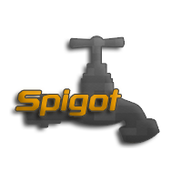

# Plugins

## Advanced AFK

Then look no further, AdvancedAFK offers you advanced detection that will 
detect and optionally kick players using all types of afk devices. 
Everything is customizable in the config and there are bypass 
permissions which cancel checks on specified user.

- [SpigotMC](https://www.spigotmc.org/resources/advanced-afk.73461/)

## Frozen Join

Frozen Join is a plugin which lets you fully customize the 
join/quit messages, along with their permissions. It allows the use 
of unlimited formats for all your different group messages.

- [SpigotMC](https://www.spigotmc.org/resources/frozen-join.73288/)

## Blocker

Blocker is a plugin which allows it's users to define and block certain commands 
using permissions. Featuring unlimited profiles it can be a perfect perk for 
donator commands.

- [SpigotMC](https://www.spigotmc.org/resources/blocker.73334/)

## ChatColor

_Coming soon.._

## Arena

_Coming soon.._

# About Me 

My name is Frosty and I am an 18 year old student from Slovenia. 
I enjoy developing minecraft plugins and creating new and unique server 
gamemodes. Below you can see my current public plugins as well as my SpigotMC and GitHub profiles.

  
  
  
    
